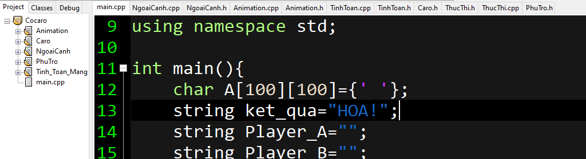
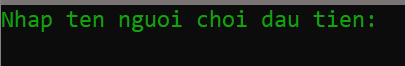
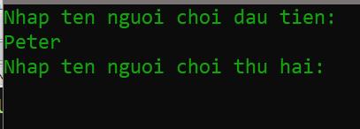
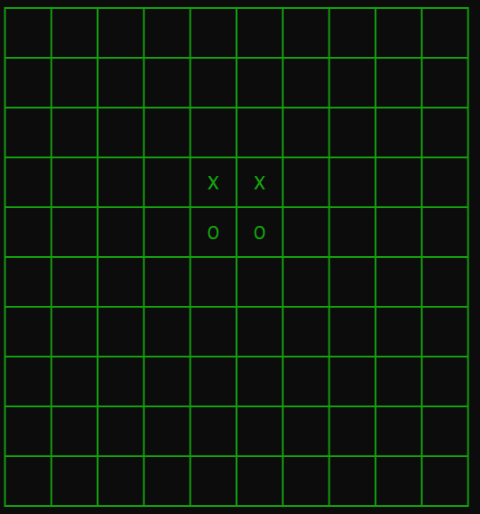

# 1. Project Overview

# 2. What's project ?
- This is the caro project running on console and writed by c++. You can download and run it. Have Fun!
# 3. Configuring and Running the project
## 2.1. Configuring the project
- I use Devc++ to create the project. So before running it, you muse download and install the devc++ app. 
## 2.2. Running the project
- It's very easy to run it.
- Step 1: Clicking the Cocaro.dev file
 
	
	
- Step 2: Clicking the Compile and Running button	

# 4. Link Demo
- To see how it run. You can go to my channel by submitting the following link:
- Video on Youtube [Caro](https://www.youtube.com/watch?v=ACS88-aGXAg&list=PLQ2CCbB0dUEvVqunPohu795RpU3rJe5qS)
